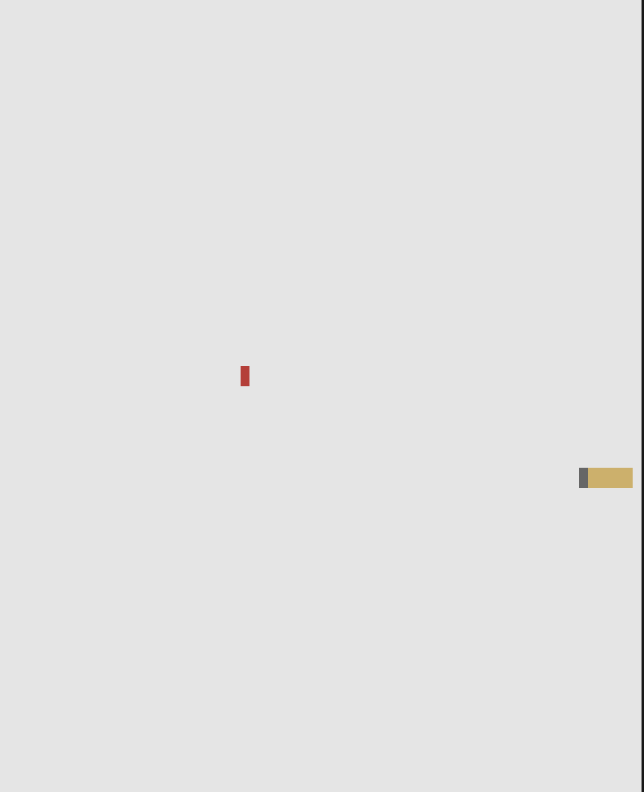

# snake-client
snake client project
# Snake Client Project

Snake game is a very popular video game. It is a video game concept where the player maneuvers a dot and grows it by ‘eating’ pieces of food. As it moves and eats, it grows and the growing snake becomes an obstacle to smooth maneuvers. The goal is to grow it to become as big as possible without bumping into the side walls, or bumping into itself, upon which it dies.

This is simply a multiplayer take on the genre.

Before you can run this client, you will need to be running the server side which you can download and install from here. 

## Final Product

## Copy the code client on my repo
    https://github.com/Sebas024/snake-client

## Installation
    cd /vagrant or /labber
    git clone https://github.com/lighthouse-labs/snek-multiplayer.git
    npm install
    npm run play

## Getting started
    open terminal
    split terminal into 2
    cd to snek-multiplayer on the 1st terminal
    cd to snake-client on 2nd terminal
    start node play.js on snek-multiplayer
    start node play.js on snake-client

- Follow steps inside the snek server repo to run the server side
- Run the development snake client using the `node play.js` command.